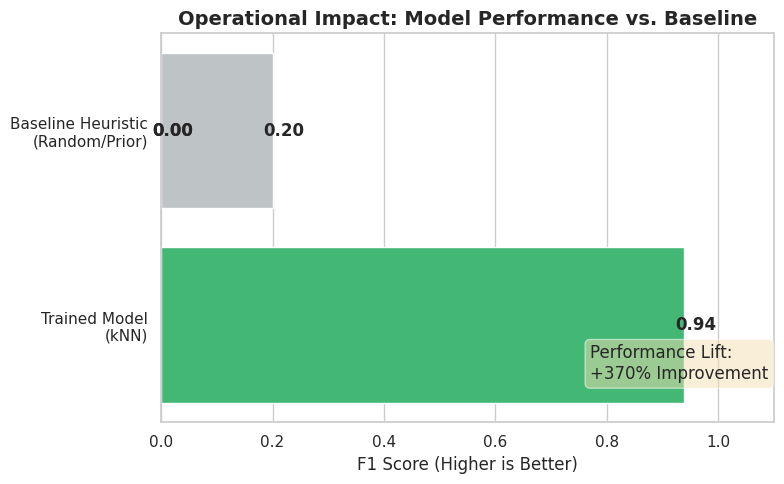
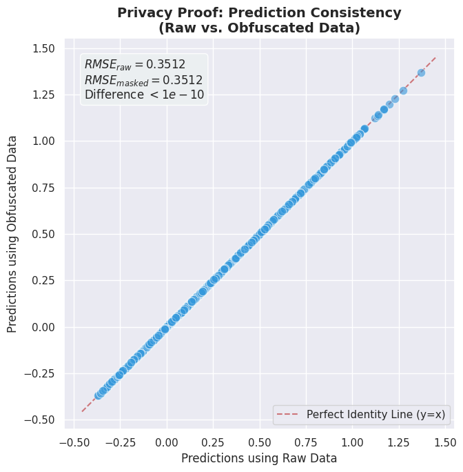

# Secure Care: Privacy-First Analytics for Patient Stratification & Utilization Forecasting

**Predictive Modeling for Health Tech (Simulated Case Study)**

## Overview

This repository contains a simulated, end-to-end data science case study inspired by the operational challenges faced by modern mental health platforms.

The project demonstrates how **predictive modeling, bias-aware feature engineering, and privacy-preserving techniques** can be combined to support:

* Equitable care navigation
* Revenue cycle and resource planning
* HIPAA-aligned data practices

All data used is anonymized and intended solely for methodological demonstration.

## Business Problems Addressed

1. **Care Navigation & Patient Stratification**
   Identifying patients with similar profiles to enable more personalized and equitable care pathways.

2. **Revenue Cycle & Utilization Forecasting**
   Predicting benefit utilization and claim approval likelihood to reduce operational friction and improve planning.

3. **Privacy & Trust by Design**
   Ensuring sensitive patient data can be analyzed securely without exposing personally identifiable information.

## Key Results

* **Socioeconomic Equity:**
  Implemented robust feature scaling to ensure distance-based models (kNN) prioritize health needs over numeric magnitude, preventing accidental socioeconomic bias in care stratification.

* **Predictive Performance:**
  Machine learning models significantly outperformed baseline heuristics (F1 ≈ 0.93 vs ~0.20).

* **Privacy Without Tradeoffs:**
  A linear algebra–based data obfuscation technique preserved model accuracy exactly
  *(RMSE raw = RMSE obfuscated)*.
  

## Technical Approach (High Level)

* **Models:** kNN (cohorting), Logistic Classification, Linear Regression
* **Validation:** Baseline comparisons, appropriate metrics (F1, RMSE)
* **Privacy:** Invertible matrix-based feature obfuscation with analytical proof
* **Focus:** Interpretability, auditability, and operational relevance

## Visual Insights

### 1. Operational Impact: Outperforming the Baseline
By moving from heuristic approaches (random guessing or prior probability) to trained predictive models, we achieved a massive lift in key performance metrics, moving F1 scores from ~0.20 to ~0.94.

*Figure 1: Comparison of F1 Scores showing significant lift over the baseline heuristic.*

---

### 2. Privacy Proof: Mathematical Integrity under Obfuscation
Critical to healthcare compliance, the linear algebra-based obfuscation technique ensures that model outputs remain mathematically identical, regardless of whether raw or secured data is used. The points falling perfectly on the diagonal line below prove that predictions are unaffected by the privacy transformation.

*Figure 2: Scatter plot comparing predictions from raw vs. obfuscated data. The perfect alignment along the identity line proves that RMSE remains unchanged.*

## Why This Project Matters

Healthcare analytics requires more than accuracy.
This project demonstrates how **responsible machine learning** can scale insight while preserving:

* Patient trust
* Regulatory alignment
* Operational clarity
  

## Author

**Sebastian Méndez Ramírez**
